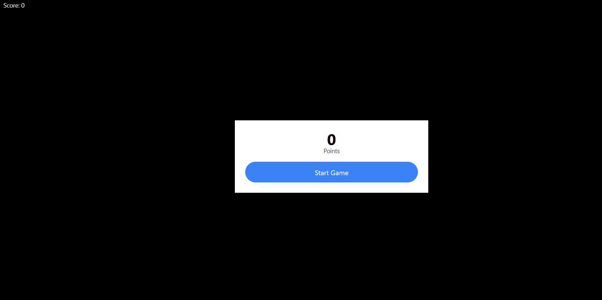
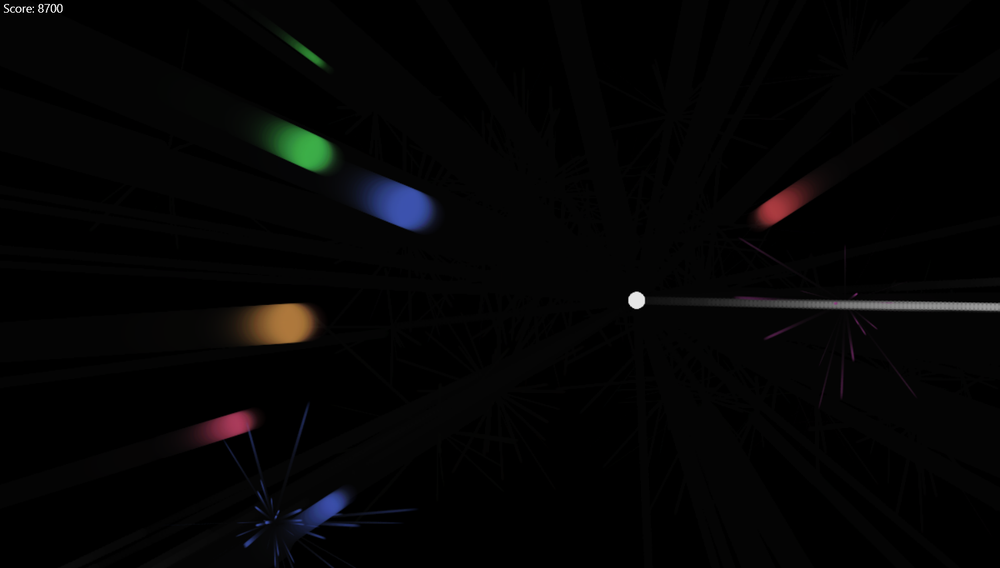
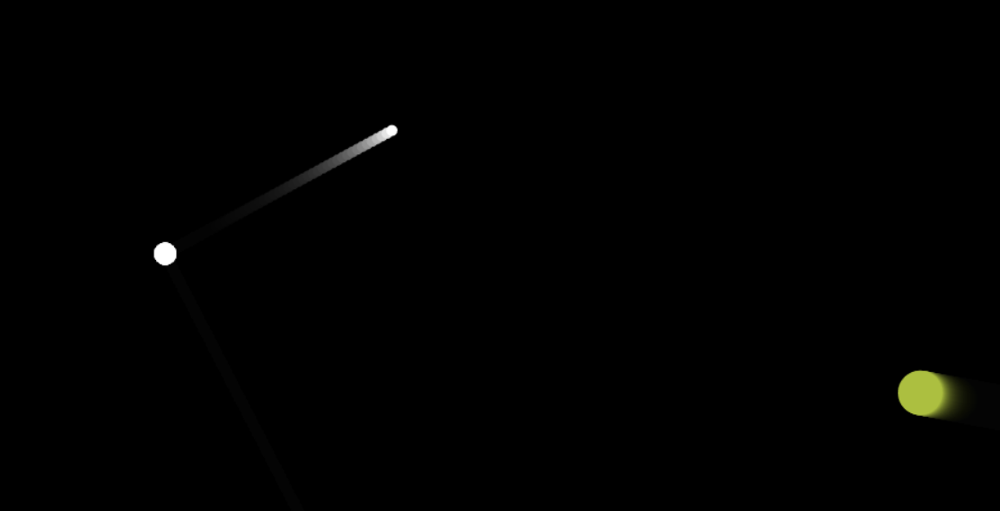
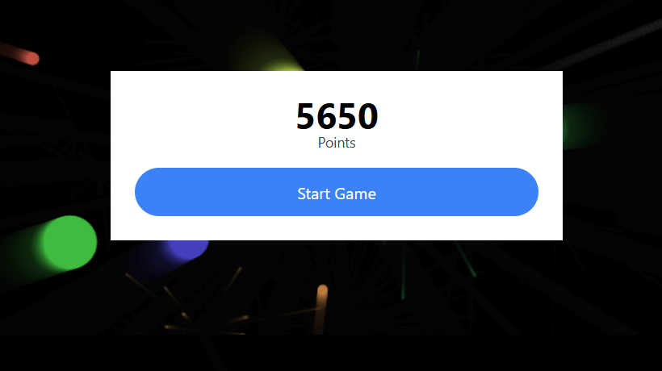

# Splash Attack

Splash Attack is a bubble shooter created with HTML Canvas.
In this game, players will see how long they can last against the endless wave of bubbles!

# Getting Started
- Clone repo to machine using 
``` 
git clone https://github.com/hvphan1993/splashattack.git
```
- Right-click index.html and open in preferred browser to view game and test  
- Seems a bit slow on Chrome, Firefox works best so far.

Alternatively
- Access game and play by clicking [Here!](https://hvphan1993.github.io/splashattack/)

## Built With
- JavaScript
- HTML Canvas

## Features
- Score
- Animations for bubbles being hit
- Animations for bubbles changing size
- Randomly appearing bubbles

## Screenshots

Game start


Dynamic Bubble Enemies and Impact


Bullet Effects


Game Over Screen



##  Future Goals
- Create menu screen
- Make player moveable
- Have the game run smoothly on all browsers
    - No stutter or slow down
- Add in sound effects and music

## Acknowledgements
Thanks to Chris Courses for the tutorial on how to set up this project. 


